## 🚹️ Profile

I'm a web developer from Brazil

- 💞️ I’m interested in everything
 
- 🌱 I’m currently learning php and javascript, (laravel, vuejs, node, nestjs, reactjs, react-native...)
 
- 👀 I’m looking to learn everything i can about Information technology and Computer Science.
 
- 📫 How to reach me? Try these links

## 🧰 Toolbox (Clique para filtrar entre os repositorios)

_Languages_

    

_Javascript Frameworks_

   

_PHP Frameworks_

 

_Databases_

 

_Tooling_

    

_CMS/Front_

   

_DevOPS/Deployment_

 

_OSs_

   

|  |
| ------------- | 

|  |
| ------------- |

|  |
| ------------- |

| |
| ------------- |

<!---
Unix-User/Unix-User is a ✨ special ✨ repository because its `README.md` (this file) appears on your GitHub profile.
You can click the Preview link to take a look at your changes.
--->
